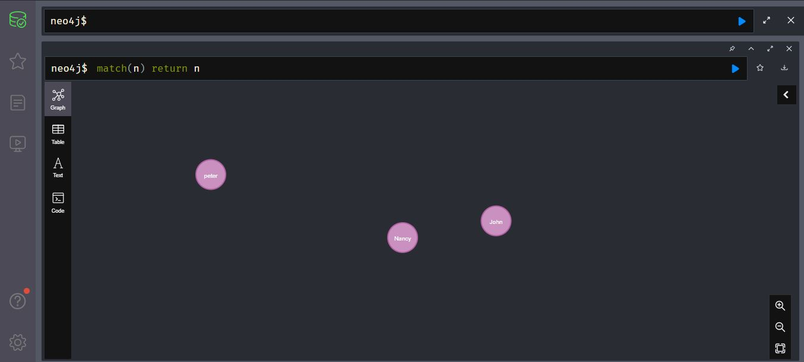
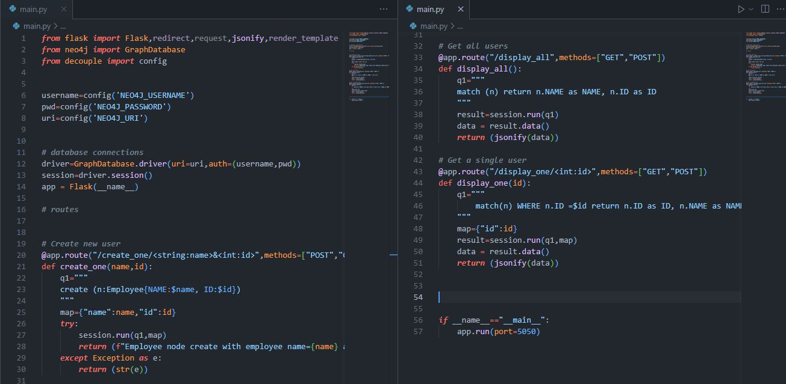

# CRUD App

This is a simple RESTful API written with Flask python framework and neo4j graph database.

## API Reference

#### Create new user
```http
  POST /create_one/id&name
```
#### Get all user

```http
  GET /display_all
```

#### Get single user

```http
  GET /display_one/id
```


| Parameter | Type     | Description                |
| :-------- | :------- | :------------------------- |
| `id` | `int` | **Required**. User's id |
| `name` | `string` | **Required**. User's Name |


## Tech Stack

**Client:** Postman

**Server:** Python, FLask, neo4j


## Installation

Install Flask with pip

```bash
  venv\Script\activate
  python main.py
```
    # Screenshots
**Nodes in the neo4j graph DB**


** source Code**


